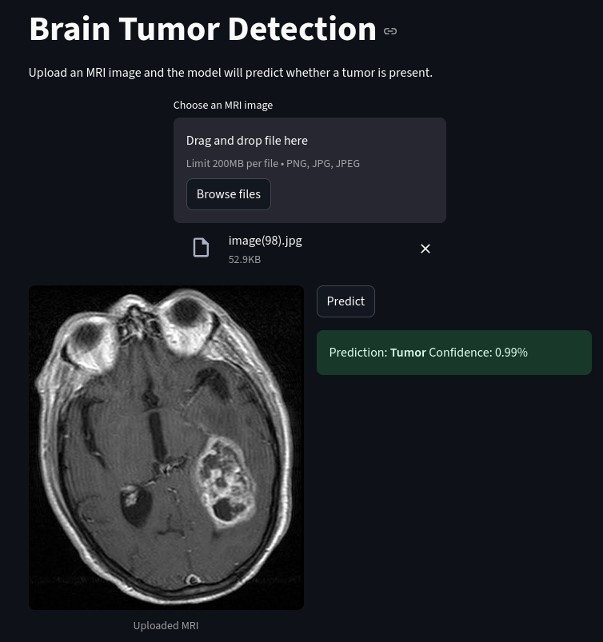

# Brain Tumor Prediction Web App

An interactive web application for **brain tumor detection** using a **custom-trained CNN model** with transfer learning. Users can upload MRI scans and get predictions in real time through a **Streamlit frontend** powered by a **FastAPI backend** using ONNX inference.

st.markdown("")
---

## Features

- **Custom-trained model** using **DenseNet** and **transfer learning**.
- **Data augmentation** applied to improve generalization
- **High performance**: \~89% accuracy and recall**
- **Interactive web interface**: Upload MRI scans and get instant predictions
- **Fully Dockerized**: Easy deployment with Docker and Docker Compose
- **Lightweight**: No database required. No need to have Tensorflow installed. Get inference using ONNX with a pre-trained model.

---

## Dataset

The model was trained on the **Brain Tumor Classification MRI** dataset:\
[https://www.kaggle.com/datasets/sartajbhuvaji/brain-tumor-classification-mri](https://www.kaggle.com/datasets/sartajbhuvaji/brain-tumor-classification-mri)

---

## Notebook

The training process and model evaluation can be found in the Kaggle notebook:\ (subject to change)
[https://www.kaggle.com/code/arsalanjafari/tumor-vs-no-tumor-transfer-learning-cnn-acc-90](https://www.kaggle.com/code/arsalanjafari/tumor-vs-no-tumor-transfer-learning-cnn-acc-90)

---

## Installation

Clone the repository and run the app using Docker Compose:

```bash
git clone https://github.com/yourusername/brain-tumor-webapp.git
cd brain-tumor-webapp
docker-compose up --build
```

---

## Usage

- **FastAPI backend**: [http://localhost:8000/docs](http://localhost:8000/docs)
- **Streamlit frontend**: [http://localhost:8501](http://localhost:8501)

Upload MRI scans via the Streamlit interface to get instant predictions of **tumor** vs **no tumor**.

---

## Tech Stack

- **Python 3.11**
- **FastAPI** – REST API backend
- **Streamlit** – Interactive frontend
- **DenseNet + Transfer Learning** – Model architecture
- **Pillow** – Image processing
- **Docker & Docker Compose** – Containerized deployment
- **ONNX** = Model Inference

---

## Results

# Model Evaluation Summary

**Accuracy:** 0.8883  
**Precision:** 0.9169  
**Recall:** 0.8883

---

# Classification Report

| Class      | Precision | Recall   | F1-Score | Support  |
|------------|-----------|---------|----------|----------|
| tumor      | 0.7103    | 0.9810  | 0.8240   | 105      |
| no_tumor   | 0.9920    | 0.8547  | 0.9182   | 289      |
| accuracy   | 0.8883    | 0.8883  | 0.8883   | 0.8883   |
| macro avg  | 0.8512    | 0.9178  | 0.8711   | 394      |
| weighted avg | 0.9169  | 0.8883  | 0.8931   | 394      |


---

## License

This project is open-source under the MIT License.

